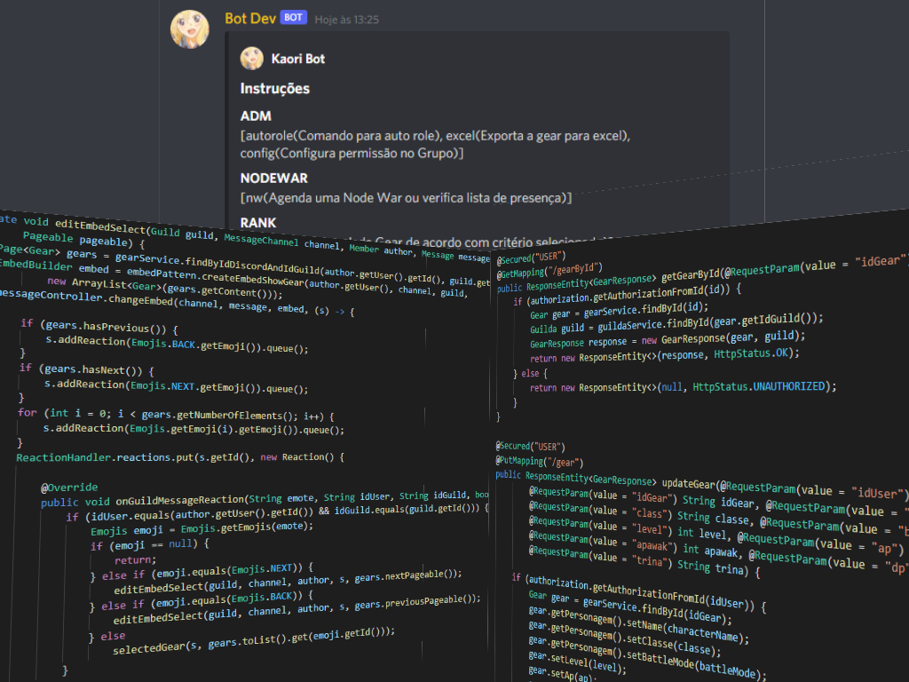

# Kawori

> Projeto de Bot para Discord atraves da biblioteca JDA e utilizando Java Spring Boot para fornecer funcionalidades de API RESTful.

### Ajustes e melhorias

O projeto ainda está em desenvolvimento e as próximas atualizações serão voltadas nas seguintes tarefas:

- [x] Implementação de API Key
- [ ] Implementação de PUT service para servidor/painel interno
- [ ] Implementação de models para dados basicos(classes,battleModes,trina)
- [ ] Melhoria no model Gear

## 💻 Pré-requisitos

Antes de começar, verifique se você atendeu aos seguintes requisitos:
* Você instalou a versão mais recente de `<Java / Spring boot / JDA / Maven>`
* Você tem uma máquina `<Windows>`. 

[⬆ Voltar ao topo](#nome-do-projeto) 
